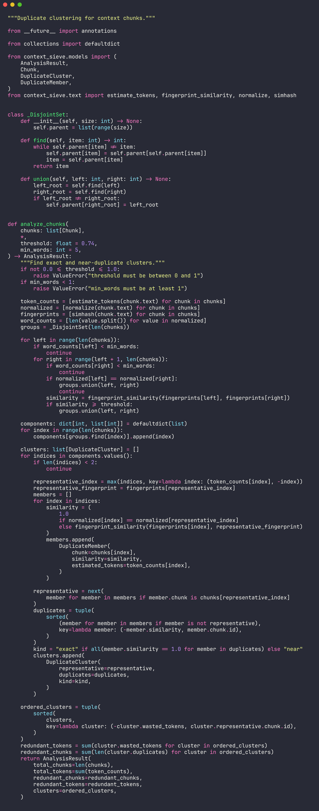
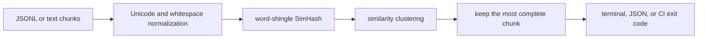

# context-sieve

**Find repeated context before it becomes an inference bill.**

RAG pipelines, support agents, and prompt assembly systems often collect the same passage from
multiple sources. The model receives every copy, but the extra tokens add cost, latency, and noise.
`context-sieve` scans a context bundle locally, groups exact and near-duplicate chunks, and shows
which copy to keep.



```text
context-sieve scan
5 chunks · ~97 tokens · 2 redundant chunks
estimated waste: ~40 tokens (41.2% of input)

[1] near cluster · keep support-chunks.jsonl:auth-1 · save ~40 tokens
    remove support-chunks.jsonl:auth-2 (similarity 100.0%, ~20 tokens)
    remove support-chunks.jsonl:auth-3 (similarity 75.0%, ~20 tokens)
```

## Why it is useful

Context duplication is easy to miss after retrieval, reranking, source merging, and prompt
templating. This tool gives AI engineers a deterministic preflight check without sending sensitive
text to another service or requiring an embedding model.

Key properties:

- detects normalized exact matches and near-duplicates using 64-bit SimHash
- accepts JSONL context records or delimiter-separated text files
- estimates redundant tokens and picks the most complete chunk as the representative
- emits readable terminal output or JSON for automation
- provides a budget gate for CI with `--fail-over`
- runs offline with no runtime dependencies

## Install

`context-sieve` requires Python 3.11 or newer.

```bash
git clone https://github.com/mertefekurt/context-sieve.git
cd context-sieve
python -m venv .venv
source .venv/bin/activate
python -m pip install -e .
```

For development tools:

```bash
python -m pip install -e ".[dev]"
```

## Scan a context bundle

JSONL input uses `text` and `id` by default:

```json
{"id":"doc-17","text":"Retry failed requests with exponential backoff.","source":"runbook"}
```

Run the included example:

```bash
context-sieve examples/support-chunks.jsonl
```

Choose different fields or generate a machine-readable report:

```bash
context-sieve retrieval.jsonl \
  --text-field content \
  --id-field chunk_id \
  --threshold 0.88 \
  --output json
```

Plain-text files are also supported. Separate chunks with a line containing `---`:

```bash
context-sieve prompt-context.txt --input-format text
```

### Use it as a quality gate

The command exits with status `2` when estimated waste exceeds the allowed percentage:

```bash
context-sieve build/context.jsonl --fail-over 15
```

This makes token redundancy enforceable in ingestion jobs or CI without treating parse errors and
budget failures as the same condition.

| Exit code | Meaning |
| ---: | --- |
| `0` | scan completed within budget |
| `1` | invalid input or arguments |
| `2` | redundancy exceeded `--fail-over` |

## How the scan works



Exact matching is case- and whitespace-insensitive. Near-duplicate matching compares SimHash
fingerprints built from two-word shingles. `--threshold` controls how conservative clustering is;
raise it to avoid grouping lightly related passages. Chunks shorter than `--min-words` are ignored
because fingerprints are unstable for very small inputs.

The token count is intentionally an estimate based on words and punctuation. It is suitable for
relative waste checks while keeping the package provider- and tokenizer-independent.

## Project layout

```text
src/context_sieve/
├── analyzer.py   # clustering and representative selection
├── cli.py        # argument parsing and exit-code policy
├── loaders.py    # JSONL and plain-text ingestion
├── models.py     # immutable result types
├── report.py     # terminal and JSON renderers
└── text.py       # normalization, token estimates, and SimHash
```

## Tests

```bash
ruff check .
ruff format --check .
pytest --cov=context_sieve
```

The test suite covers normalization, fingerprints, malformed input, both loaders, exact and near
duplicate clustering, representative selection, report behavior, and CI budget exits.

## License

MIT
